# vue3网易云音乐

## 介绍
个人练习vue3项目 使用Vue3 + TypeScript + Pinia + Vant 
实现H5网易云音乐播放播放器H5
## 项目
- 开发框架：Vue3
- 脚手架：Vue-cli
- 组件库：Vant
- 状态管理：Pinia
- 语法扩展：TypeScript、Less
- 打包工具：Webpack
- 代码规范：ESLint

## 实现功能
1. 邮箱登录、手机号登录
2. 首页
3. 歌单详情
4. 跟手详情
5. 歌曲播放
6. 个人中心
7. 用户详情
8. 关注和粉丝
9. 歌曲播放
10. 电台播放
11. 消息发送
12. 歌曲、歌单分享好友
13. 歌词滚动
14. 搜索
15. mv播放
16. 夜间模式
17. 云盘音乐上传
18. 最近播放
19. 歌单创建、编辑

## 项目截图
### 登录
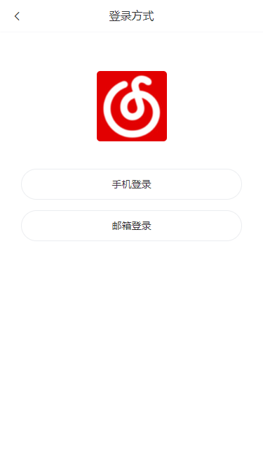
### 首页

### 每日推荐
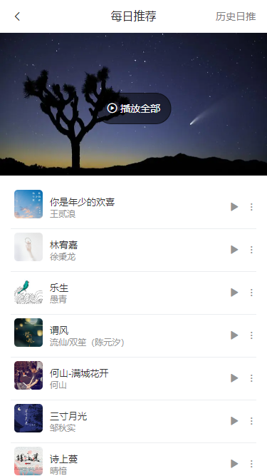
### 历史日推
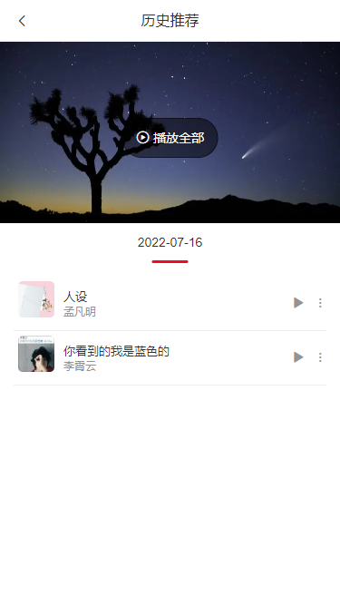
### 歌单广场
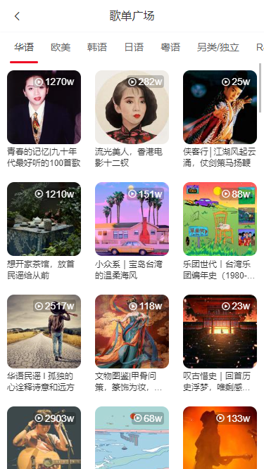
### 排行榜
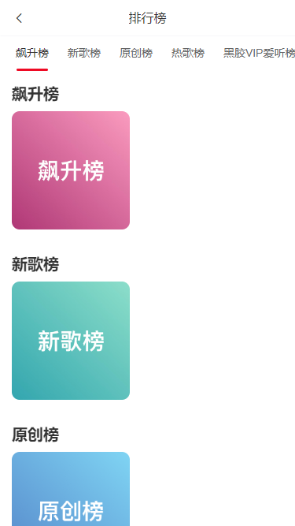
### 排行榜详情、歌单详情
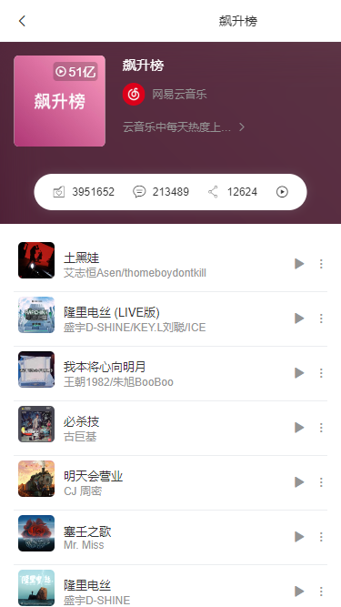
### 歌单评论
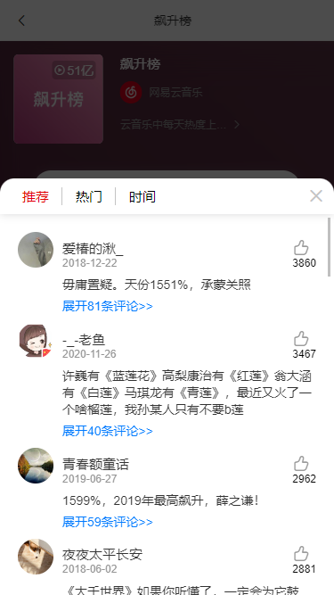
### 歌手列表
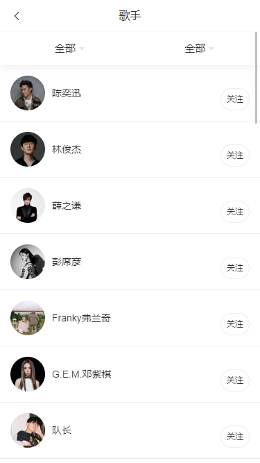
### 歌手详情

### 数字专辑
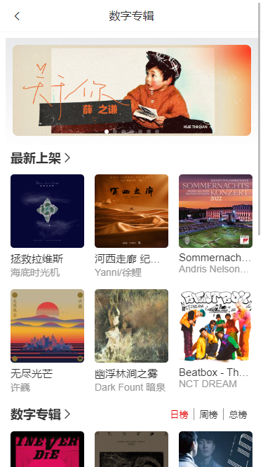
### 播客（电台）

### 电台详情
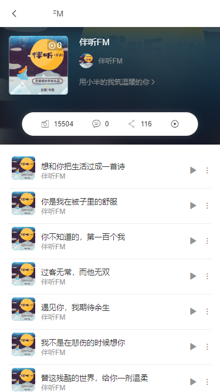
### 个人中心
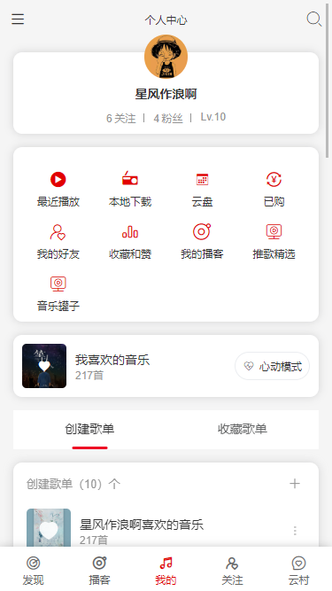
### 关注和粉丝
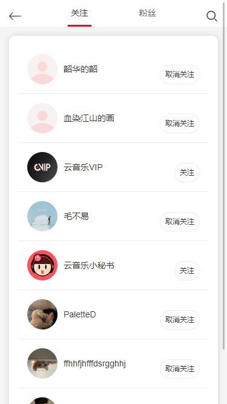
### 云盘
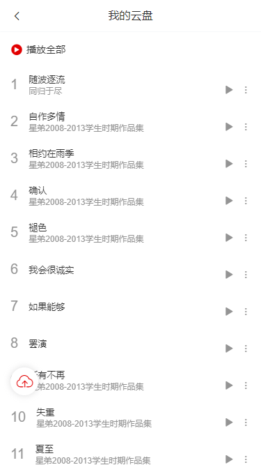
### 用户中心
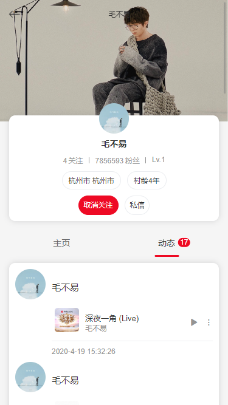
### 朋友圈
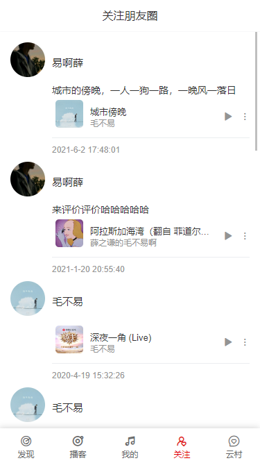
### 侧边菜单

### 聊天会话
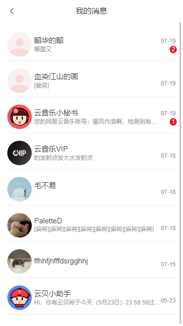
### 聊天界面
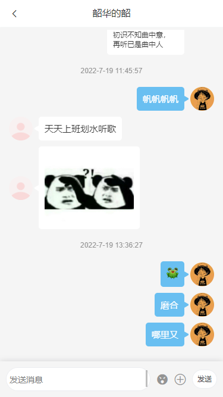
### 歌曲播放
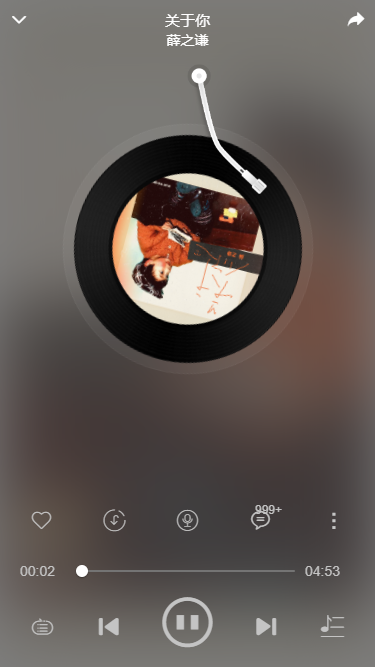
### 歌曲评论
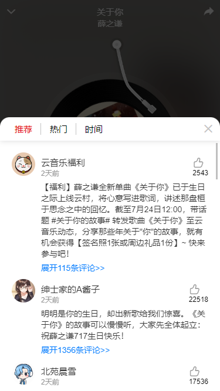
### 歌词滚动
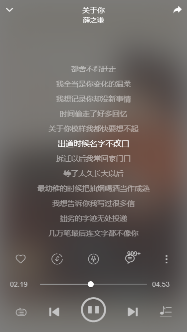
### 夜间模式


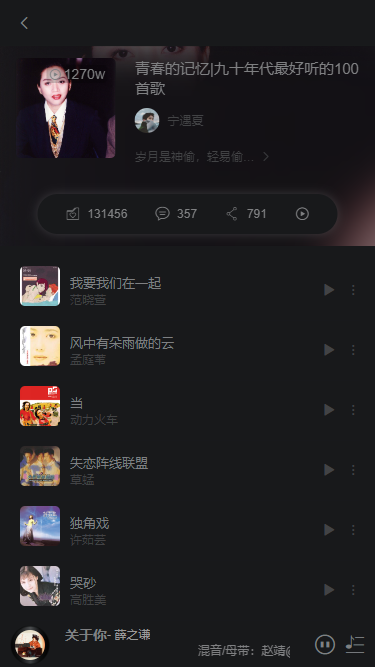
### 歌词滚动


## 接口地址项目 https://github.com/Binaryify/NeteaseCloudMusicApi

## Project setup
```
npm install
```

### Compiles and hot-reloads for development
```
npm run serve
```

### Compiles and minifies for production
```
npm run build
```

### Lints and fixes files
```
npm run lint
```

### Customize configuration
See [Configuration Reference](https://cli.vuejs.org/config/).
